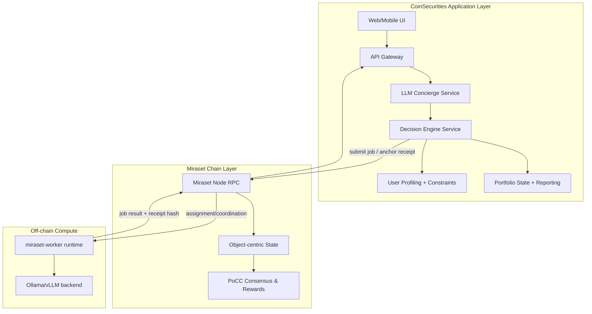
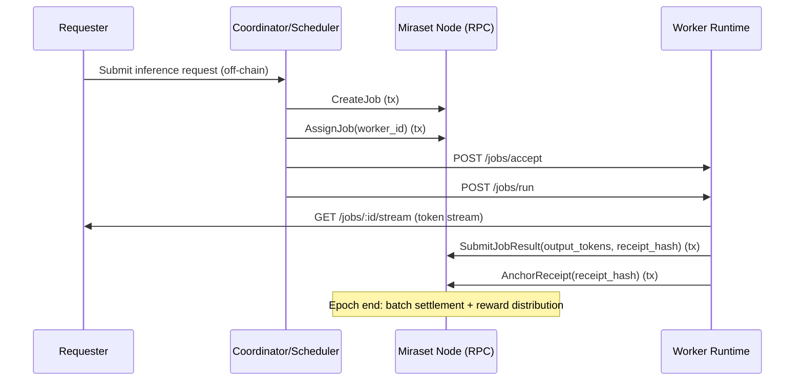
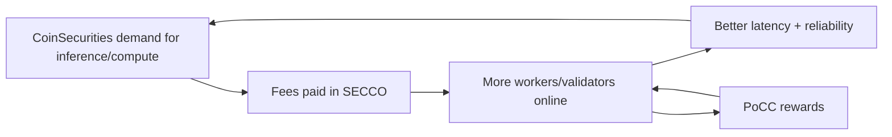
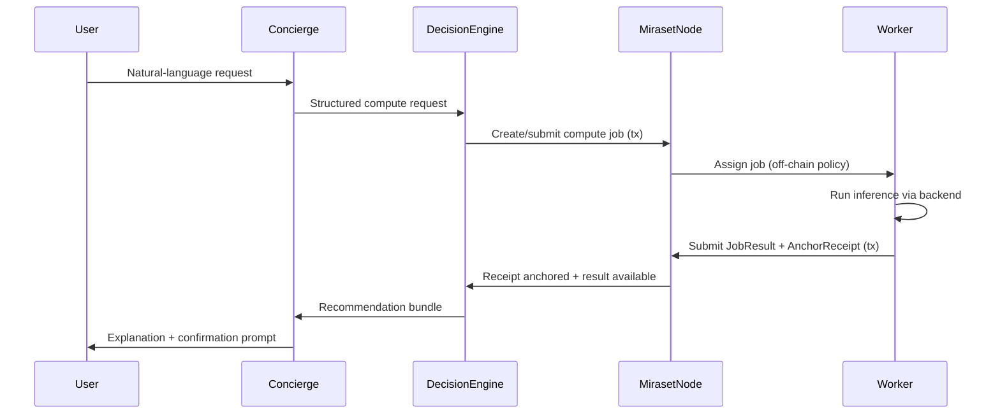

# CoinSecurities — Technical Whitepaper (Extended)

**Version:** 0.1 (Extended Draft)  
**Date:** 2026-02-27  
**Product:** CoinSecurities  
**Base L1:** Miraset Chain  
**Native token:** SECCO (on Miraset Chain)  

> This extended whitepaper expands the core draft into a more implementation-oriented architecture document.
> It focuses on the rationale for the AI × Blockchain coupling, the data contracts, security model, and scaling paths.

---

## Table of Contents

1. Abstract
2. Portfolio Management Problematic
3. Solution Overview
4. System Architecture (Optimal Target)
5. AI Layer (Concierge + Decision Engine)
6. Blockchain Layer (Miraset Chain)
7. AI × Blockchain Synergy
8. Security, Risk, and Failure Modes
9. Token Design (SECCO) and Incentives
10. Appendix: Data Contracts and Diagrams

---

## 1. Abstract

CoinSecurities is a SaaS investment platform that provides AI-assisted portfolio management while enforcing capital controls on-chain.

It combines:

- a **Natural Language Concierge** (LLM agent) that understands user intent and produces explainable outputs,
- a deterministic **Decision Engine** (trading core + risk) that computes portfolio actions,
- and a compute-first settlement and incentive network (**Miraset Chain**) that anchors proofs/receipts, runs PoCC consensus, and rewards GPU-providing participants.

The system is designed around a principle:

> The AI should *never* be the system of record. The chain and deterministic core are.

---

## 2. Portfolio Management Problematic

### 2.1 Pain points

The table below summarizes the repeatable failure modes of real-world portfolio management, and why they persist even for experienced users.

| Category | Problem | Why it matters |
|---|---|---|
| Execution | Users juggle multiple tools and venues | Leads to missed rebalances and inconsistent strategy execution |
| Risk | Constraints are not enforced by default | Human error is the main source of blowups |
| Transparency | Users can’t audit managed decisions | Trust is replaced by marketing, not verifiable state |
| Cost | Institutional-grade computation is expensive | Optimization and simulation are gated by compute budgets |
| UX | Finance is complex for non-experts | User intent needs translation into precise actions |

### 2.2 Technical requirements

From those pain points, CoinSecurities derives a set of system-level requirements. These requirements guide the architecture and define what must be “hard” guarantees vs. what can be best-effort.

CoinSecurities targets:

- **On-chain capital control** (lock/escrow, explicit rules, verifiable transitions)
- **Deterministic computation** for the actual recommended actions
- **Explainability** as a first-class output
- **Verifiability** of compute where possible, and at least auditable commitments
- **Scalable compute access** without central infrastructure lock-in

---

## 3. Solution Overview

CoinSecurities works as a multi-layer system. The diagram below shows the highest-level flow: users talk to the concierge, the deterministic core computes actions, and the chain coordinates/settles verifiable compute.

```mermaid
flowchart LR
  U[User] -->|Natural language| C[AI Concierge]
  C -->|Structured request| DE[Decision Engine]
  DE -->|Portfolio action plan| C
  C -->|Explain + confirm| U

  DE -->|Compute jobs| MC[Miraset Chain]
  MC -->|Job assignment| W[Workers (GPU nodes)]
  W -->|Results/receipts| MC
  MC -->|State + settlement| CS[CoinSecurities Backend]
  CS -->|Portfolio state| U
```

### 3.1 Separation of concerns

To avoid common failures (LLM hallucinations, opaque strategy changes, and ambiguous responsibility), CoinSecurities uses strict separation of concerns. The table below states the contract of each layer.

| Layer | What it does | What it must NOT do |
|---|---|---|
| Concierge (LLM) | intent parsing, tool routing, explanation | decide portfolio actions without deterministic core |
| Decision Engine | compute actions (optimize, risk, rebalance) | hold funds or perform irreversible settlement |
| Blockchain (Miraset) | anchor commitments, execute state transitions, incentivize compute | run full inference on-chain |

---

## 4. System Architecture (Optimal Target)

This section describes an optimal target architecture. Some pieces exist already in the Miraset repo (node, PoCC, worker runtime, receipts), while the CoinSecurities SaaS layer is application-level.

### 4.1 Components

The following diagram expands the high-level picture into three layers (application, chain, compute) and shows how requests and proofs move between them.



### 4.2 Data planes

CoinSecurities includes three distinct data planes. These planes are intentionally separated because they have different reliability, privacy, and auditability requirements.

1. **User intent plane** (unstructured natural language) — handled by Concierge
2. **Deterministic compute plane** (structured inputs/outputs) — handled by Decision Engine
3. **Settlement plane** (verifiable state transitions and anchors) — handled by the chain

This design prevents “LLM as a database” failure modes and allows auditing.

---

## 5. AI Layer

### 5.1 Concierge architecture

The Concierge is an orchestrator. It should produce a **strict typed request** to the Decision Engine.

To make the conversion from human intent to system actions concrete, we show an example below.

**Example intent:**

- “I want to be conservative, focus on liquidity, and rebalance weekly.”

**Typed request:**

- `set_risk_profile(conservative)`
- `set_constraints(max_single_asset=0.2, min_liquidity=...)`
- `recommend_rebalance(horizon=7d)`

#### 5.1.1 Concierge safety contract

These rules describe how the concierge is constrained so it can’t directly produce irreversible actions or bypass risk limits.

- The Concierge can only call whitelisted tools.
- The Decision Engine validates every request.
- Capital-affecting actions require explicit user confirmation.

### 5.2 Decision Engine architecture

The Decision Engine should be deterministic and testable.

#### 5.2.1 Modules

The table below defines a minimal and stable contract between the concierge and the decision core. Each module consumes typed inputs and produces structured outputs.

| Module | Inputs | Outputs |
|---|---|---|
| User Profiling | risk profile, constraints, preferences | normalized constraints + profile vector |
| Optimization | market data, constraints, portfolio | target weights, rebalance deltas |
| Risk | portfolio, scenarios | risk metrics, limit violations |
| Execution Plan | deltas + venue constraints | orders, sequencing, guardrails |

#### 5.2.2 Determinism

To remain auditable:

- Use versioned models/parameters.
- Store all inputs used to compute recommendations.
- Hash and anchor the **recommendation bundle** on-chain (optional but desirable).

### 5.3 Quant trading practices and how CoinSecurities uses them

CoinSecurities treats “AI for investing” as an application of mature quantitative trading practices.

The LLM concierge improves UX and explainability, but the core system is built around the same research and production controls used in professional quant environments:

- deterministic computation paths,
- strict data discipline,
- reproducible research artifacts,
- and risk-first execution.

#### 5.3.1 Data discipline (best practice)

Quant systems fail more often due to bad data than bad models. CoinSecurities adopts a strict data posture:

- **Versioned datasets**: market data and derived features are versioned so a recommendation can be reproduced later.
- **Survivorship bias controls**: asset universes are defined with explicit inclusion rules.
- **Corporate actions & adjustments**: splits, dividends, symbol changes are normalized (where applicable).
- **Latency and freshness**: the engine distinguishes between “close prices” and real-time execution prices.

How we apply it:

- The Decision Engine consumes **a declared dataset version** as part of every computation request.
- Recommendation bundles include dataset metadata (or hashes) so outputs can be re-audited.

#### 5.3.2 Research workflow: hypothesis → backtest → validation

In professional quant workflows, the research path is controlled:

1. **Hypothesis** (what inefficiency or structural effect we target)
2. **Feature definition** (what signals are allowed)
3. **Backtest engine** (simulation with realistic costs)
4. **Validation** (out-of-sample, robustness checks)
5. **Promotion to production** (versioned strategy package)

How we apply it:

- Strategies are packaged as **versioned configs/models** (e.g., `strategy_id + version`).
- The Decision Engine can emit a strategy version identifier with every recommendation.

#### 5.3.3 Backtesting best practices (what we enforce)

Backtests are easy to manipulate unintentionally (overfitting). CoinSecurities uses the following controls:

| Practice | Why it matters | How it appears in the product |
|---|---|---|
| Walk-forward / rolling evaluation | reduces overfitting to one regime | strategy validation pipeline |
| Out-of-sample testing | prevents “training on the answer” | separation of train/validation periods |
| Realistic transaction costs | avoids fake performance | slip/fee models in simulation |
| Liquidity constraints | prevents untradeable allocations | constraints in optimization |
| Parameter stability | unstable strategies blow up in prod | bounded parameter spaces |

In MVP, these practices show up as:

- constraints in the optimization module,
- a risk module enforcing limits,
- and strategy outputs that include expected costs and confidence bounds.

#### 5.3.4 Risk-first portfolio construction

Quant products are engineered around risk budgets and constraint enforcement:

- concentration limits
- volatility targeting
- drawdown controls
- liquidity floors
- diversification constraints

How we apply it:

- Risk constraints are part of the **typed request** produced by the concierge.
- The Decision Engine refuses to output an execution plan that violates hard constraints.

#### 5.3.5 Execution: from target weights to real orders

Even a correct allocation can lose money due to poor execution.

CoinSecurities models execution as a separate step:

- target weights → rebalance deltas → execution plan

The execution plan includes:

- order sizing rules
- venue constraints
- sequencing and throttling
- “do-not-trade” conditions during high volatility

#### 5.3.6 What the blockchain adds to quant best practices

Traditional quant stacks are auditable only inside one firm.

Miraset Chain enables optional external verifiability primitives:

- the system can **anchor hashes** of recommendation bundles (inputs + strategy_id/version + outputs),
- and can anchor compute receipts (PoCC) when recommendations rely on distributed inference/compute.

This doesn’t turn trading into an on-chain system by default; it provides a cryptographic audit trail when needed.

---

## 6. Blockchain Layer (Miraset Chain)

CoinSecurities uses Miraset Chain as its L1 for three reasons:

1. **Settlement and capital control**: state transitions for locks/escrow and auditable accounting.
2. **Verifiability hooks**: receipt anchoring enables challenges and reproducible accounting without putting raw prompts/outputs on-chain.
3. **Compute incentives**: PoCC rewards keep GPU capacity online and paid for useful work.

This section is intentionally written to match the *current Rust implementation* (object-centric state in `miraset-core` + node in `crates/miraset-node`) while remaining compatible with the conceptual architecture described in `docs/ARCHITECTURE.md`, `docs/SOW.md`, and `docs/REWARDS.md`.

### 6.1 Design goals and trust boundaries

Miraset Chain follows a pragmatic “off-chain compute, on-chain settlement” model:

- LLM inference happens off-chain on GPU workers.
- On-chain state stores only what is required for correctness, settlement, and audit.

In the MVP trust model:

- A **coordinator/scheduler** may be trusted for *assignment* (to prevent fake jobs) but not for accounting alone.
- Accounting relies on **signatures**, **receipt-hash commitments**, and deterministic settlement rules.

### 6.2 Object-centric state model (implemented)

Miraset implements an object-centric model (Sui-inspired) as Rust enums/structs. The chain’s “resources” (workers, jobs, anchors) are explicit objects.

The table below lists the minimal objects required for a verifiable inference workflow.

Key object types (from `miraset-core::ObjectData`):

| Object | Purpose | Key fields (high level) |
|---|---|---|
| WorkerRegistration | worker identity + GPU capabilities | endpoints, gpu_model, vram_total_gib, supported_models, stake_bond, status |
| ResourceSnapshot | VRAM availability (epoch-scored) | epoch_id, worker_id, vram_avail_gib, signature |
| InferenceJob | job request with constraints/escrow | epoch_id, requester, model_id, max_tokens, fixed_price_per_token, escrow_amount, status |
| JobResult | result accounting + signatures | output_tokens, receipt_hash, worker_signature, coordinator_signature? |
| ReceiptAnchor | on-chain commitment to receipt payload | job_id, epoch_id, receipt_hash, anchored_at |
| EpochBatch | batch settlement marker | epoch_id, batch_root, total_verified_tokens, settled |

> Implementation note: the current repo includes a placeholder Move VM wrapper for future programmable transactions, but the core system currently operates via native Rust transaction types.

### 6.3 Transaction surface (implemented)

Miraset state transitions are driven by signed transactions (nonces provide replay protection).

The table below maps the key PoCC workflow actions to concrete transaction variants.

| Workflow action | Transaction type (Rust) | Who signs |
|---|---|---|
| Worker registration | `RegisterWorker` | worker/operator |
| Capacity reporting | `SubmitResourceSnapshot` | worker/operator |
| Job creation | `CreateJob` | requester / scheduler (policy) |
| Job assignment | `AssignJob` | coordinator / scheduler |
| Result submission | `SubmitJobResult` | worker |
| Receipt commitment | `AnchorReceipt` | worker (or allowed submitter) |
| Dispute | `ChallengeJob` | challenger |

### 6.4 Receipt payloads and hash anchoring

Off-chain inference output is large and often private. Miraset therefore anchors **only a hash** of a structured receipt payload.

At a minimum (MVP), the receipt payload contains:

- `job_id`, `epoch_id`
- `worker_pubkey`
- `model_id`
- `request_hash` (hash of prompt + parameters; raw prompt stays off-chain)
- `response_stream_hash` (hash over streamed output chunks or final output)
- `output_tokens`
- `price_per_token`
- timestamps (`timestamp_start`, `timestamp_end`)
- signatures (worker, and optionally coordinator)

The on-chain anchor stores `receipt_hash = H(receipt_payload)`.

Why this matters:

- **Auditability**: anyone can fetch the off-chain payload by hash and validate its integrity.
- **Privacy**: prompts/outputs don’t need to be on-chain.
- **Scalability**: the chain stays compact while still enabling disputes.

### 6.5 Economics: two money flows

Miraset separates *market payment* from *protocol rewards*.

This is essential because it prevents a single incentive mechanism from serving two incompatible goals.

1) **User → Worker payment** (service pricing)
- Jobs are prepaid into escrow.
- Settlement transfers `output_tokens * PRICE_PER_TOKEN` to the worker.

2) **Protocol rewards** (network incentive)
- Each epoch allocates a rewards budget split into:
  - capacity/validator pool
  - compute pool

The table below captures the intent of each flow.

| Flow | Source | Destination | Purpose |
|---|---|---|---|
| Market payment | requester escrow | worker | pay for actual service consumption |
| Protocol rewards | inflation/treasury budget | validators/workers | bootstrap supply, reliability, decentralization |

### 6.6 PoCC accounting: what is measured

PoCC uses two orthogonal measurements (per epoch):

- **Uptime** `U_i(e) ∈ [0,1]`: derived from signed heartbeats sampled by validators/watchers.
- **Available VRAM** `V_i(e)`: time-average of signed resource snapshots.
- **Verified tokens** `T_i(e)`: sum of verified output tokens across settled jobs.

To improve Sybil-resistance and reduce “monster node” dominance, VRAM contribution can be saturated (`VRAM_CAP_GIB`).

### 6.7 End-to-end job lifecycle (settlement-centric)

The following sequence describes the minimal verifiable job pathway.



### 6.8 Practical interfaces (current implementation)

Miraset currently exposes an HTTP RPC for basic read operations and transaction submission:

- `GET /balance/{address}`
- `GET /nonce/{address}`
- `GET /block/latest`
- `GET /block/{height}`
- `GET /events`
- `GET /chat/messages`
- `POST /tx/submit`

The worker runtime exposes an Ollama-like HTTP API:

- `GET /health`
- `POST /jobs/accept`
- `POST /jobs/run`
- `GET /jobs/:id/status`
- `GET /jobs/:id/stream`
- `POST /jobs/:id/report`

---

## 7. AI × Blockchain Synergy

### 7.1 Why this coupling exists

CoinSecurities needs scalable compute for:

- portfolio optimization (constrained optimization)
- scenario analysis and stress testing
- forecasting and market regime detection

A centralized architecture concentrates:

- cost (single provider / cloud bill)
- censorship risk (provider restrictions)
- operational risk (single infra)

A PoCC-based network provides:

- elastic compute supply
- a native incentive loop (SECCO)
- verifiable accounting primitives (receipts)

### 7.2 The “good” flywheel

The diagram below shows the positive feedback loop between application demand and network supply. This loop is what makes the combined system more resilient than either part alone.



### 7.3 Priority compute (“master account”) rationale

CoinSecurities can reserve a portion of compute capacity (n%) for internal risk-sensitive calculations.

Different implementations have different trade-offs. The table below summarizes the options.

Implementation patterns:

| Pattern | Pros | Cons |
|---|---|---|
| Quota reservation | predictable; easy SLA | may reduce openness if too large |
| Priority fees | market-based; neutral | cost spikes; requires fee mechanism |
| Dedicated worker pool | simplest operationally | centralization risk |

Recommendation for MVP: **Dedicated worker pool** by policy, then evolve to **priority fees** governed on-chain.

---

## 8. Security, Risk, and Failure Modes

### 8.1 Threat model overview

The table below lists the most relevant threats for the combined system and the intended mitigations.

| Threat | Example | Mitigation |
|---|---|---|
| Receipt fraud | over-reporting tokens | signatures + on-chain anchoring + disputes |
| Worker downtime | uptime spoofing | multi-observer uptime sampling |
| LLM hallucination | incorrect portfolio action | deterministic core validation + confirmations |
| Coordinator abuse | biased assignment | transparent rules + decentralization roadmap |
| Data leakage | prompts/strategies leaked | request hashing + off-chain storage controls |

### 8.2 Fail-safe posture

The system is designed to degrade gracefully. These fallback behaviors are not “nice to have”; they are required to avoid catastrophic outcomes.

- If the Concierge fails, users still use direct API.
- If inference fails, Decision Engine can fall back to conservative defaults.
- If chain is congested, actions queue with explicit user-visible state.

---

## 9. Token Design (SECCO) and Incentives

SECCO has protocol-level roles:

- fees
- stake/collateral
- rewards

### 9.1 Reward envelopes (draft)

There are two consistent ways to express rewards:

1. **Per-epoch budget model** (canonical in `docs/REWARDS.md`)
2. **Per-block envelope model** (draft for SECCO in CoinSecurities materials)

To avoid contradictions, we define:

- a governance parameter `R_total_per_epoch`
- and an equivalent `R_total_per_block = R_total_per_epoch / blocks_per_epoch`

### 9.2 Why two pools

The economic model uses two pools because capacity and compute are different goods. The table below summarizes what each pool is designed to incentivize.

| Pool | What it incentivizes |
|---|---|
| Capacity pool | stable supply (uptime + VRAM availability) |
| Compute pool | useful work (verified tokens) |

---

## 10. Appendix: Data Contracts and Diagrams

### 10.1 Sequence: request → compute → settlement

The following sequence diagram shows the critical path from a user’s request to on-chain anchoring of compute results.



### 10.2 Tables: what is on-chain vs off-chain

A core scaling idea is that large or private artifacts remain off-chain, while the chain stores compact commitments that preserve auditability.

| Artifact | On-chain? | Off-chain? | Why |
|---|---:|---:|---|
| Portfolio state (balances/locks) | Yes | Optional cache | source of truth |
| Recommendation explanation text | No | Yes | large + non-deterministic |
| Recommendation bundle hash | Optional | Yes | auditability |
| Receipt payload | Anchor only | Yes | privacy + size |
| Inference output tokens | Count only | Yes | scaling |

---

**End of document.**
